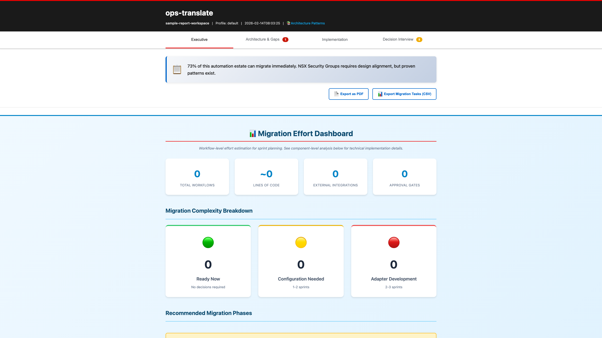
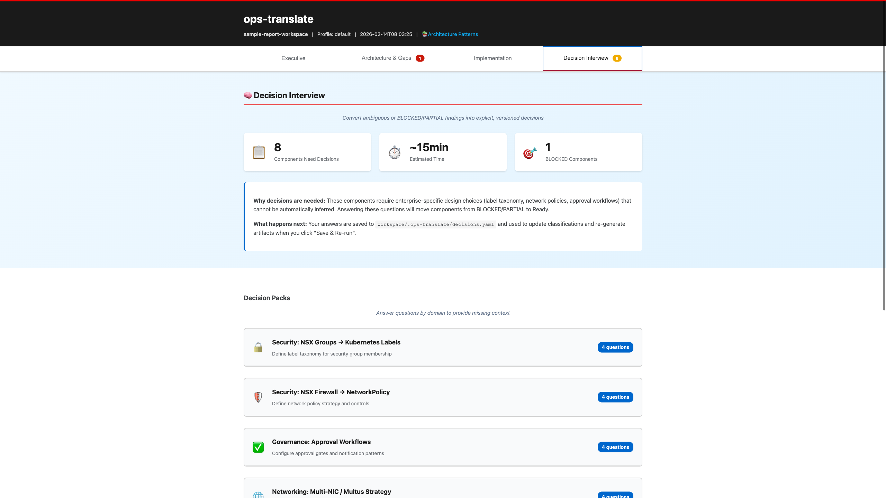
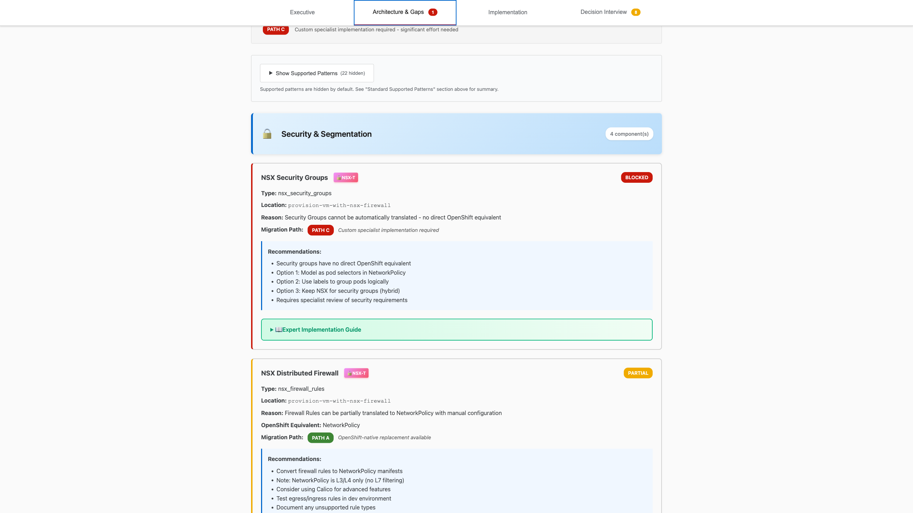

# ops-translate

[](https://github.com/tsanders-rh/ops-translate/actions/workflows/ci.yml)
[](https://github.com/tsanders-rh/ops-translate/actions/workflows/lint.yml)
[](https://codecov.io/gh/tsanders-rh/ops-translate)
[](https://www.python.org/downloads/)
[](https://opensource.org/licenses/Apache-2.0)

> **AI-assisted migration from VMware automation to OpenShift Virtualization**

Stop manually rewriting your PowerCLI scripts and vRealize workflows. Let AI extract operational intent and generate production-ready Ansible + KubeVirt artifacts — safely, transparently, and locally.

---

## 🚀 Quick Links

- [Try It Now](#-quick-start) - Get started in 5 minutes
- [View Sample Report](examples/sample-report/) - See what ops-translate generates
- [Documentation](docs/TUTORIAL.md) - Step-by-step tutorial
- [Examples](examples/) - Real-world PowerCLI & vRealize samples

---

## 📌 Project Status

**v1 Prototype** - Demonstrating core workflow. Not for production use.

Built for ops and infra engineers evaluating migration paths from VMware to OpenShift Virtualization.

---

## Table of Contents

- [What It Does](#-what-it-does)
- [What You Get](#-what-you-get)
- [Quick Start](#-quick-start)
- [See It In Action](#-see-it-in-action)
- [Why ops-translate?](#-why-ops-translate)
- [How is ops-translate Different?](#how-is-ops-translate-different)
- [Key Features](#-key-features)
- [When Do You Need an LLM?](#when-do-you-need-an-llm)
- [Advanced Features](#-advanced-features)
- [Example Output](#example-output)
- [Configuration](#-configuration)
- [Installation](#-installation)
- [Documentation](#-documentation)
- [Development](#development)
- [Contributing](#contributing)
- [License](#license)

---

## ⚡ What It Does

`ops-translate` bridges the gap between VMware automation and cloud-native infrastructure:

1. **Import** your existing PowerCLI scripts and vRealize Orchestrator workflows
2. **Extract** a normalized operational intent model using AI
3. **Merge** multiple sources into a single unified intent
4. **Generate** Ansible playbooks and KubeVirt manifests ready for OpenShift

> 💡 All processing happens locally. No execution by default. Full transparency at every step.

---

## 📦 What You Get

After running ops-translate, you'll have:

- ✅ **Migration Readiness Report** - Interactive HTML with classification, gaps, and recommendations
- ✅ **KubeVirt Manifests** - Ready-to-deploy VirtualMachine YAML
- ✅ **Ansible Playbooks** - Executable roles with TODO placeholders for manual work
- ✅ **NetworkPolicy & MultiNetworkPolicy** - Primary and secondary network policies from NSX rules
- ✅ **NetworkAttachmentDefinitions** - Secondary network definitions from NSX segments
- ✅ **Gap Analysis** - Detailed migration paths for each component
- ✅ **Decision Guidance** - Interactive questionnaire for missing context

All generated artifacts are customizable via Jinja2 templates.

---

## 🏃 Quick Start

**First time?** See [Installation](#-installation) for setup instructions.

### Option 1: Try with Examples (Fastest)

```bash
# Assuming you've completed installation
cd ops-translate

# Initialize workspace
ops-translate init demo && cd demo

# Try with a provided example
ops-translate import --source powercli --file ../examples/powercli/environment-aware.ps1

# Extract and view operational intent
ops-translate summarize
ops-translate intent extract

# Review migration readiness BEFORE generating
ops-translate report
open output/report/index.html  # Interactive report with expert recommendations

# After reviewing the report, generate artifacts
ops-translate generate --profile lab                    # YAML (default)
ops-translate generate --profile lab --format kustomize # GitOps
ops-translate generate --profile lab --format argocd    # ArgoCD

# OR if VMs were already migrated via MTV, generate validation playbooks
ops-translate generate --profile lab --assume-existing-vms

# Generate Event-Driven Ansible rulebooks from vRO event subscriptions
ops-translate generate --profile lab --eda           # Generate EDA + Ansible/KubeVirt
ops-translate generate --profile lab --eda-only      # Generate only EDA rulebooks

# Review generated files
tree output/
```

**Preview the report**: See a [sample HTML report](examples/sample-report/) generated from real-world examples.

See [examples/](examples/) for more sample PowerCLI scripts and vRealize workflows.

### Option 2: Use Your Own Scripts

```bash
# Initialize workspace (optionally with custom templates)
ops-translate init my-project --with-templates && cd my-project

# Import your VMware automation
ops-translate import --source powercli --file /path/to/your-script.ps1
ops-translate import --source vrealize --file /path/to/workflow.xml

# Import vRealize bundles (.package, .zip, or directory)
ops-translate import --source vrealize --file /path/to/vro-export.package
ops-translate import --source vrealize --file /path/to/vro-export/

# Extract and merge operational intent
ops-translate summarize
ops-translate intent extract
ops-translate intent merge

# Validate the extracted intent
ops-translate dry-run

# Generate OpenShift artifacts in your preferred format
ops-translate generate --profile lab                    # YAML
ops-translate generate --profile lab --format kustomize # GitOps with Kustomize
ops-translate generate --profile prod --format argocd   # ArgoCD Applications
```

**Result**: Ansible roles, KubeVirt VM manifests, and a clear migration path in your choice of format.

---

## 📊 See It In Action

**Key differentiator**: ops-translate generates a comprehensive migration readiness report that goes beyond simple "yes/no" translatability assessments.

### Interactive HTML Report

The `ops-translate report` command generates an interactive dashboard with:

#### Executive Summary
Get an at-a-glance view of your migration status with classification breakdowns and key metrics.



#### Classification & Filtering
Interactive cards let you filter components by translation status (SUPPORTED, PARTIAL, BLOCKED, MANUAL).


#### Decision Interview
Provide missing context for BLOCKED/PARTIAL components through an interactive questionnaire. Your decisions automatically upgrade component classifications.



#### Gap Analysis
Detailed component-by-component breakdown with migration paths and OpenShift equivalents.



**Interactive Features:**
- 🎯 Filter by classification level
- 📊 4-tab progressive disclosure (Executive → Architecture → Implementation → Decisions)
- ✅ Export to PDF or CSV
- 🧠 Decision Interview for gathering missing context
- 📋 Embedded expert recommendations

---

## 🎯 Why ops-translate?

- **Safe by design**: Read-only operations, no live system access in v1
- **Transparent**: Every assumption and inference is logged
- **Flexible**: Supports AI-assisted or template-based generation (`--no-ai`)
- **Conflict detection**: Identifies incompatibilities between source automations
- **Day 2 aware**: Captures operational patterns beyond just provisioning

---

## How is ops-translate Different?

| Feature | Manual Migration | MTV Only | ops-translate |
|---------|-----------------|----------|---------------|
| VM Migration | Manual rebuild | ✅ Automated | ✅ Automated |
| Automation Translation | ❌ Manual rewrite | ❌ Not included | ✅ AI-assisted |
| Gap Analysis | ❌ None | ❌ Basic | ✅ Comprehensive |
| Decision Support | ❌ None | ❌ None | ✅ Interactive Interview |
| Custom Templates | ❌ | ❌ | ✅ Jinja2-based |
| Output Formats | YAML only | YAML only | YAML, JSON, Kustomize, ArgoCD |

---

## ⭐ Key Features

- Parse PowerCLI parameters, environment branching, and resource profiles
- Extract vRealize workflow logic including approvals and governance
- **Interactive Decision Interview** - Answer questions to provide missing context and upgrade component classifications
- **Automatic gap analysis for vRealize workflows** - Detects NSX operations, custom plugins, and REST calls
- **NSX network segmentation translation** - Intelligent correlation of NSX segments and firewall rules
- **OVN-Kubernetes MultiNetworkPolicy generation** - Secondary network policies for OpenShift multi-network pods
- **Smart network policy routing** - Automatically routes rules to primary (NetworkPolicy) or secondary (MultiNetworkPolicy) networks
- **Translatability assessment** - Classifies components as SUPPORTED, PARTIAL, BLOCKED, or MANUAL
- **Migration path guidance** - Provides specific recommendations with production-grade patterns
- **Smart Ansible scaffolding** - Generates TODO tasks and role stubs for manual work
- **MTV (Migration Toolkit for Virtualization) support** - Generate validation playbooks for already-migrated VMs
- **Event-Driven Ansible (EDA) rulebook generation** - Translate vRO event subscriptions to preserve reactive automation patterns
- Detect conflicts during intent merge (different approval requirements, network mappings, etc.)
- Generate KubeVirt VirtualMachine manifests
- Generate Ansible roles with proper structure and defaults
- Support multiple LLM providers (OpenAI, Anthropic, or mock for testing)
- Multiple output formats (YAML, JSON, Kustomize, ArgoCD)

---

## When Do You Need an LLM?

**Short answer**: Only for intent extraction. Everything else works without AI.

### LLM Required ✅ (One Step Only)

**`ops-translate intent extract`** - Convert PowerCLI/vRealize to normalized intent
- **Why**: Understands semantic meaning of imperative code
- **Alternative**: Write intent.yaml files manually (see [INTENT_SCHEMA.md](docs/INTENT_SCHEMA.md))
- **Options**: OpenAI, Anthropic, or mock provider (for testing)
- **Cost**: Typically $0.01-0.10 per file for extraction

### No LLM Needed ❌ (Everything Else)

All other commands are **deterministic** and **LLM-free**:
- `ops-translate import` - Copies files
- `ops-translate summarize` - Static pattern matching
- `ops-translate intent merge` - YAML reconciliation
- `ops-translate dry-run` - Schema validation
- `ops-translate generate` - Template-based (Jinja2) + Direct translation

### Two Translation Paths

**PATH 1: Direct Translation** (Common Patterns - No LLM)
```
PowerCLI/vRealize  ──[Parser]──>  Statements  ──[Mappings]──>  Ansible Tasks
   (New-VM, etc.)    NO AI         (categorized)   NO AI          (kubevirt_vm)
```

**PATH 2: Intent Extraction** (Complex Scenarios - LLM Optional)
```
PowerCLI/vRealize  ──[LLM]──>  intent.yaml  ──[Templates]──>  Ansible + KubeVirt
   (custom logic)    NEEDS AI    (normalized)   NO AI NEEDED    (cloud-native)
```

**When each path is used:**
- **Direct Translation**: Standard PowerCLI cmdlets (New-VM, Start-VM, New-TagAssignment) and vRO workflows with common patterns
- **Intent Extraction**: Complex custom logic, multiple source merging, advanced scenarios

### Three Modes

1. **AI-Assisted Extraction** (Recommended) - Use LLM for extraction, templates for generation
2. **Manual Intent Creation** (No LLM Required) - Write intent.yaml files yourself, 100% deterministic
3. **Mock Provider** (Testing/Demo) - No API key needed, uses predefined templates

**Bottom line**: LLM extracts *what* your automation does. Templates generate *how* to do it in OpenShift.

---

## 🔧 Advanced Features

Quick navigation to advanced capabilities:

- [NSX Multi-Network Policy Translation](#nsx-multi-network-policy-translation) - Automatic secondary network policies
- [Multiple Output Formats](#multiple-output-formats) - YAML, JSON, Kustomize, ArgoCD
- [Template Customization](#template-customization) - Customize generated artifacts
- [MTV Mode](#mtv-migration-toolkit-for-virtualization-mode) - Post-migration validation playbooks
- [Dry-Run Validation](#enhanced-dry-run-validation) - Validate before execution
- [vRealize Translation](#vrealize-workflow-translation-to-ansible) - Workflow to Ansible
- [Gap Analysis](#automatic-gap-analysis-vrealize-workflows) - Migration readiness assessment

### NSX Multi-Network Policy Translation

When migrating vRealize workflows that configure NSX network segments and firewall rules, ops-translate automatically generates **OVN-Kubernetes MultiNetworkPolicy** resources for secondary networks alongside standard **NetworkPolicy** for primary pod networks.

#### What It Does

**Intelligent Network Policy Routing:**
- **Primary Network Rules** → Standard Kubernetes **NetworkPolicy** (pod-to-pod on default network)
- **Segment-Specific Rules** → **MultiNetworkPolicy** (traffic on secondary networks/VLANs)
- **NetworkAttachmentDefinitions** → Multus secondary network definitions from NSX segments

#### How It Works

```bash
# Import vRealize workflow with NSX operations
ops-translate import --source vrealize --file nsx-provisioning-workflow.xml

# Analyze detects NSX segments and firewall rules
ops-translate analyze

# Generate automatically correlates and routes policies
ops-translate generate --profile lab
```

**Correlation Engine** analyzes NSX firewall rule evidence to determine network scope:

| Detection Method | Confidence | Example |
|-----------------|-----------|---------|
| **Direct Reference** | 0.90 | Rule mentions segment name: `segment: 'Web-Tier-VLAN100'` |
| **IP Range Overlap** | 0.70 | Rule destination `10.10.100.50` matches segment subnet `10.10.100.0/24` |
| **VLAN Matching** | 0.70 | Both rule and segment reference `vlan: 100` |
| **Proximity Analysis** | 0.40 | Rule defined near segment in workflow |

**Output Structure:**

```
output/
├── multi-network-policies/           # OVN-Kubernetes secondary networks
│   ├── CORRELATION_REPORT.md         # How rules were assigned
│   ├── web-tier-vlan100-allow-web-to-app.yaml
│   └── db-tier-vlan200-allow-backup.yaml
├── network-policies/                 # Standard Kubernetes primary network
│   ├── allow-internet-egress.yaml
│   └── allow-dns.yaml
└── network-attachments/              # Multus NetworkAttachmentDefinitions
    ├── web-tier-vlan100.yaml
    └── db-tier-vlan200.yaml
```

#### Example: NSX Workflow Translation

**NSX vRealize Workflow:**
```xml
<workflow-item name="createWebSegment" type="task">
  <script>
    var webSegment = nsxClient.createSegment({
      displayName: "Web-Tier-VLAN100",
      vlanIds: [100],
      subnets: ["10.10.100.0/24"]
    });
  </script>
</workflow-item>

<workflow-item name="allowWebToApp" type="task">
  <script>
    nsxClient.createFirewallRule({
      name: "Allow Web to App",
      segment: "Web-Tier-VLAN100",
      sources: ["web-sg"],
      destinations: ["app-sg"],
      services: ["HTTP", "HTTPS"],
      action: "ALLOW"
    });
  </script>
</workflow-item>
```

**Generated MultiNetworkPolicy (OVN-Kubernetes):**
```yaml
apiVersion: k8s.cni.cncf.io/v1beta1
kind: MultiNetworkPolicy
metadata:
  name: web-tier-vlan100-allow-web-to-app
  namespace: default
  annotations:
    k8s.v1.cni.cncf.io/policy-for: default/web-tier-vlan100
    source-location: workflow.xml:145
  labels:
    translated-from: nsx-firewall
    network-scope: secondary
    network-attachment: web-tier-vlan100
spec:
  podSelector:
    matchLabels:
      app: web
  policyTypes:
  - Ingress
  ingress:
  - from:
    - podSelector:
        matchLabels:
          app: app-tier
    ports:
    - protocol: TCP
      port: 80
    - protocol: TCP
      port: 443
```

**Generated NetworkAttachmentDefinition:**
```yaml
apiVersion: k8s.cni.cncf.io/v1
kind: NetworkAttachmentDefinition
metadata:
  name: web-tier-vlan100
  namespace: default
spec:
  config: |
    {
      "cniVersion": "0.3.1",
      "name": "web-tier-vlan100",
      "type": "bridge",
      "vlan": 100,
      "ipam": {
        "type": "whereabouts",
        "range": "10.10.100.0/24",
        "gateway": "10.10.100.1"
      }
    }
```

#### Correlation Report

The `CORRELATION_REPORT.md` explains how each rule was assigned:

```markdown
# NSX Segment-to-Rule Correlation Report

## Summary
- **Primary Network Rules**: 2
- **Segments with Rules**: 3

## Primary Network Rules
- Allow-Internet-Egress
- Allow-DNS

## Secondary Network Rules (MultiNetworkPolicy)

### Segment: Web-Tier-VLAN100
- **NetworkAttachmentDefinition**: `default/web-tier-vlan100`
- **VLAN IDs**: 100
- **Subnets**: 10.10.100.0/24
- **Correlation Confidence**: 0.95
- **Firewall Rules**: 1

| Rule Name | Evidence |
|-----------|----------|
| `Allow-Web-to-App` | Direct reference to segment 'Web-Tier-VLAN100' |

## Correlation Methods
1. **Direct Reference** (0.90) - Rule evidence contains segment name
2. **IP Range Overlap** (0.70) - Rule IPs within segment subnet
3. **VLAN Matching** (0.70) - Same VLAN ID
4. **Proximity Analysis** (0.40) - Same workflow location
```

#### OpenShift Deployment

**1. Apply NetworkAttachmentDefinitions:**
```bash
oc apply -f output/network-attachments/
```

**2. Apply MultiNetworkPolicies:**
```bash
oc apply -f output/multi-network-policies/
```

**3. Attach pods to secondary networks:**
```yaml
apiVersion: v1
kind: Pod
metadata:
  name: web-server
  annotations:
    k8s.v1.cni.cncf.io/networks: web-tier-vlan100
spec:
  containers:
  - name: nginx
    image: nginx:latest
```

#### Requirements

- **OpenShift 4.12+** (OVN-Kubernetes is the default CNI)
- **Multus CNI** (pre-installed on OpenShift)
- **Bridge CNI plugin** (for VLAN support)

#### Limitations

ops-translate automatically detects and documents NSX features that don't translate to MultiNetworkPolicy:

- ✅ **Supported**: L3/L4 ingress/egress rules, IP/port/protocol filtering
- ⚠️ **Not Supported**: L7 application-aware filtering, FQDN-based rules, time-based rules, user/group-based rules

See generated policy YAML comments for specific limitations detected in your NSX configuration.

### Multiple Output Formats

ops-translate can generate artifacts in several formats to support different deployment strategies:

#### YAML (Default)
Standard Kubernetes manifests and Ansible playbooks:
```bash
ops-translate generate --profile lab --format yaml
```

Generates:
- `output/kubevirt/vm.yaml` - KubeVirt VirtualMachine manifest
- `output/ansible/site.yml` - Ansible playbook
- `output/ansible/roles/provision_vm/` - Ansible role structure

#### JSON Format
For API integration and programmatic consumption:
```bash
ops-translate generate --profile lab --format json
```

Generates JSON equivalents of all YAML manifests in `output/json/`. Perfect for:
- REST API payloads
- CI/CD pipeline integration
- Programmatic artifact manipulation

#### Kustomize/GitOps
Multi-environment GitOps structure with Kustomize:
```bash
ops-translate generate --profile lab --format kustomize
# or
ops-translate generate --profile lab --format gitops
```

Generates a full Kustomize directory structure:
```
output/
├── base/
│   ├── kustomization.yaml
│   └── vm.yaml
└── overlays/
    ├── dev/
    │   └── kustomization.yaml      # 2Gi memory, 1 CPU
    ├── staging/
    │   └── kustomization.yaml      # 4Gi memory, 2 CPUs
    └── prod/
        └── kustomization.yaml      # 8Gi memory, 4 CPUs
```

Each overlay automatically adjusts resources for its environment. Deploy with:
```bash
kubectl apply -k output/overlays/dev
kubectl apply -k output/overlays/prod
```

#### ArgoCD Applications
Full GitOps deployment with ArgoCD Application manifests:
```bash
ops-translate generate --profile lab --format argocd
```

Generates both Kustomize structure and ArgoCD resources:
```
output/
├── base/                          # Kustomize base
├── overlays/                      # Environment overlays
└── argocd/
    ├── project.yaml               # AppProject definition
    ├── dev-application.yaml       # Dev app (automated sync)
    ├── staging-application.yaml   # Staging app (partial automation)
    └── prod-application.yaml      # Prod app (manual sync)
```

Features:
- **dev**: Automated sync with prune and self-heal
- **staging**: Automated sync with prune only
- **prod**: Manual sync for safety

Apply to your cluster:
```bash
kubectl apply -f output/argocd/project.yaml
kubectl apply -f output/argocd/dev-application.yaml
```

### Template Customization

Customize generated artifacts to match your organization's standards:

```bash
# Initialize workspace with editable templates
ops-translate init my-project --with-templates
```

This copies all default templates to `templates/` in your workspace:
```
my-project/
├── templates/
│   ├── kubevirt/
│   │   └── vm.yaml.j2           # Jinja2 template for VMs
│   └── ansible/
│       ├── playbook.yml.j2      # Playbook template
│       └── role_tasks.yml.j2    # Role tasks template
└── ops-translate.yaml
```

**Edit templates** to add:
- Organization-specific labels and annotations
- Custom resource requests/limits
- Additional Ansible tasks or variables
- Company-specific naming conventions

When you run `generate`, ops-translate automatically uses your custom templates instead of defaults.

**Benefits:**
- Maintain consistency across migrations
- Encode organizational best practices
- No need to post-process generated artifacts

### MTV (Migration Toolkit for Virtualization) Mode

When VMs have already been migrated to OpenShift Virtualization using MTV, ops-translate can generate validation and day-2 operations playbooks instead of VM creation manifests:

```bash
# Generate validation playbooks for already-migrated VMs
ops-translate generate --profile lab --assume-existing-vms
```

**What changes in MTV mode:**

| Aspect | Greenfield Mode | MTV Mode |
|--------|----------------|----------|
| **VM YAML** | ✅ Generated (`output/kubevirt/vm.yaml`) | ❌ Skipped |
| **Ansible Tasks** | Create VM, wait for ready | Verify exists, validate config, apply labels |
| **Use Case** | New VM deployments | Post-migration validation |

**Generated Ansible tasks in MTV mode:**

1. **Verify VM exists** - Fails if VM not found
   ```yaml
   - name: Verify VM exists
     kubernetes.core.k8s_info:
       api_version: kubevirt.io/v1
       kind: VirtualMachine
       name: "{{ vm_name }}"
       namespace: virt-lab
     register: vm_info
     failed_when: vm_info.resources | length == 0
   ```

2. **Validate configurations** - Assert CPU/memory match intent
   ```yaml
   - name: Validate VM CPU configuration
     ansible.builtin.assert:
       that:
         - vm_info.resources[0].spec.template.spec.domain.cpu.cores == cpu_cores
       fail_msg: "CPU doesn't match intent"
   ```

3. **Apply operational labels** - Tag VMs with managed-by, environment
   ```yaml
   - name: Apply operational labels to VM
     kubernetes.core.k8s:
       state: patched
       definition:
         metadata:
           labels:
             managed-by: ops-translate
             environment: "{{ environment }}"
   ```

**Configure as default** (optional):
```yaml
# ops-translate.yaml
assume_existing_vms: true  # Always use MTV mode
```

**When to use MTV mode:**
- VMs were migrated using Migration Toolkit for Virtualization
- VMs already exist and need governance applied
- You want to validate existing VMs against operational intent
- Post-migration day-2 operations

### Enhanced Dry-Run Validation

Validate your intent and generated artifacts before execution:

```bash
ops-translate dry-run
```

Performs comprehensive checks:
- **Schema validation**: Intent YAML structure correctness
- **Resource validation**: Generated manifests are valid Kubernetes/Ansible
- **Consistency checks**: Metadata tags match intent specifications
- **Completeness**: All required inputs are defined with proper types

Output includes:
```
Dry-Run Validation Report
========================

✓ Schema validation passed
✓ 2 KubeVirt manifests validated
✓ 1 Ansible playbook validated

⚠ Review Items:
  - Input 'owner_email' has no default value
  - Consider adding min/max constraints to 'cpu' input

Execution Plan:
1. Validate inputs: vm_name, environment, cpu, memory_gb
2. Select profile based on environment
3. Generate KubeVirt manifest with tags
4. Generate Ansible playbook
5. Execute Ansible role tasks
6. Verify VM creation
7. Tag resources with metadata

Status: SAFE TO PROCEED (with 2 review items)
```

**Categories:**
- 🔴 **BLOCKING**: Must fix before execution
- 🟡 **REVIEW**: Should verify but not blocking
- 🟢 **SAFE**: No issues found

### vRealize Workflow Translation to Ansible

ops-translate automatically translates vRealize Orchestrator workflow logic into executable Ansible tasks. Common workflow patterns are converted to native Ansible modules:

**Supported Translations:**

| vRealize Element | Ansible Equivalent | Example |
|------------------|-------------------|---------|
| JavaScript validation | `assert` tasks | `if (cpu > 16) throw "error"` → `assert: cpu <= 16` |
| Variable assignments | `set_fact` tasks | `requiresApproval = (env === "prod")` → `set_fact: requiresApproval: "{{ env == 'prod' }}"` |
| Approval interactions | `pause` tasks | Approval workflow item → Interactive pause prompt |
| Email notifications | `mail` tasks | Email workflow item → `community.general.mail` |
| System.log statements | `debug` tasks | `System.log("message")` → `debug: msg: "message"` |

**Example vRealize Workflow:**
```xml
<workflow-item name="checkQuotas" type="task">
  <script>
    if (cpuCount > 16) {
      throw "CPU quota exceeded. Maximum 16 cores allowed.";
    }
    requiresApproval = (environment === "prod");
  </script>
</workflow-item>
```

**Generated Ansible Tasks:**
```yaml
# Translated from vRealize workflow
- name: Validate: CPU quota exceeded. Maximum 16 cores allowed.
  ansible.builtin.assert:
    that: cpuCount <= 16
    fail_msg: "CPU quota exceeded. Maximum 16 cores allowed."

- name: Set requiresApproval (from Check Governance)
  ansible.builtin.set_fact:
    requiresApproval: "{{ environment == 'prod' }}"

- name: Request approval: Request Approval
  ansible.builtin.pause:
    prompt: |
      VM Provisioning Request
      VM: {{ vm_name }}

      This request requires approval.
      Approve? (yes/no)
  register: approval_response
  when: "{{ requiresApproval }}"
```

**How It Works:**
1. Place vRealize workflow XML files in `input/vrealize/`
2. Run `ops-translate generate --profile lab`
3. Translated tasks are automatically prepended to Ansible playbook
4. Tasks preserve workflow execution order and logic

**Limitations:**
- Complex JavaScript expressions may generate TODOs for manual review
- External system integrations require manual implementation
- Custom vRO plugins are not auto-translated (see gap analysis)

### Automatic Gap Analysis (vRealize Workflows)

When extracting intent from vRealize workflows, ops-translate automatically analyzes them for translatability issues and provides migration guidance:

```bash
ops-translate intent extract
```

**What gets analyzed:**
- NSX-T operations (segments, firewall rules, load balancers, security groups)
- Custom vRO plugins (ServiceNow, Infoblox, etc.)
- REST API calls to external systems
- vRealize-specific constructs

**Output:**

1. **Console warnings** - Immediate feedback during extraction:
```
Running gap analysis on vRealize workflows...
  Analyzing: nsx-provisioning.xml
    ⚠ Found 3 blocking issue(s)
  ✓ Gap analysis reports written to intent/gaps.md and intent/gaps.json

⚠ Warning: Found 3 component(s) that cannot be automatically translated.
  Review intent/gaps.md for migration guidance and manual implementation steps.
```

2. **Gap reports** - Detailed analysis in `intent/`:
   - `gaps.md` - Human-readable report with migration paths and recommendations
   - `gaps.json` - Machine-readable for tooling integration

3. **Smart scaffolding** - When you run `generate`, Ansible playbooks include:
   - **TODO tasks** for PARTIAL components (need configuration)
   - **Role stubs** for BLOCKED/MANUAL components (need implementation)
   - **Migration guidance** embedded as comments

**Classification levels:**
- ✅ **SUPPORTED** - Fully automatic translation to OpenShift-native
- ⚠️ **PARTIAL** - Can translate with manual configuration needed
- 🎯 **BLOCKED** - Needs decision input or expert guidance
- 🔧 **MANUAL** - Complex custom logic requiring specialist review

**Migration paths:**
- **PATH_A**: OpenShift-native replacement available (e.g., NetworkPolicy for NSX firewall)
- **PATH_B**: Hybrid approach - keep existing system temporarily
- **PATH_C**: Custom specialist implementation required

**Example gap report snippet:**
```markdown
## NSX Firewall Rule

**Type**: `nsx_firewall_rule`
**Classification**: ⚠️ PARTIAL
**OpenShift Equivalent**: NetworkPolicy
**Migration Path**: PATH_A - OpenShift-native replacement

**Recommendations**:
- Create NetworkPolicy manifest with equivalent rules
- Test pod-to-pod connectivity
- Consider Calico for advanced features
- Review default-deny policies

**Evidence**:
nsxClient.createFirewallRule() at line 45
```

**Generated Ansible includes TODO tasks:**
```yaml
- name: "TODO: Implement NSX firewall rule migration"
  debug:
    msg: |
      CLASSIFICATION: PARTIAL
      OPENSHIFT EQUIVALENT: NetworkPolicy
      MIGRATION PATH: PATH_A - OpenShift-native replacement

      RECOMMENDATIONS:
      - Create NetworkPolicy manifest with equivalent rules
      - Test pod-to-pod connectivity
  tags: [manual_review_required]
```

This gives you a clear migration roadmap before writing any code.

---

## Example Output

After running `ops-translate generate`, you'll have:

```
output/
├── kubevirt/
│   └── vm.yaml                      # KubeVirt VirtualMachine manifest
├── ansible/
│   ├── site.yml                     # Main playbook with TODO tasks for gaps
│   └── roles/
│       ├── provision_vm/
│       │   ├── tasks/main.yml
│       │   └── defaults/main.yml
│       └── nsx_segment_migration/   # Auto-generated stub for manual work
│           ├── README.md            # Migration guidance
│           ├── tasks/main.yml       # TODO placeholders
│           └── defaults/main.yml    # Discovered parameters
├── network-policies/                # Primary network (standard NetworkPolicy)
│   ├── README.md
│   ├── allow-internet-egress.yaml
│   └── allow-dns.yaml
├── multi-network-policies/          # Secondary networks (OVN-Kubernetes)
│   ├── README.md
│   ├── CORRELATION_REPORT.md        # Segment-to-rule correlation analysis
│   ├── web-tier-vlan100-allow-web-to-app.yaml
│   └── db-tier-vlan200-allow-backup.yaml
├── network-attachments/             # NetworkAttachmentDefinitions
│   ├── README.md
│   ├── web-tier-vlan100.yaml
│   └── db-tier-vlan200.yaml
├── intent/
│   ├── gaps.md                      # Human-readable gap analysis
│   └── gaps.json                    # Machine-readable gap data
└── README.md                        # How to run the artifacts
```

---

## ⚙️ Configuration

The `ops-translate init` command automatically creates `ops-translate.yaml` with default settings. You can customize it for your environment.

### LLM Provider Setup

ops-translate supports three LLM providers for intent extraction:

#### Option 1: Anthropic Claude (Recommended)

1. **Get an API key** from [https://console.anthropic.com](https://console.anthropic.com)
2. **Set the environment variable**:
   ```bash
   export OPS_TRANSLATE_LLM_API_KEY=sk-ant-your-key-here
   ```
3. **Configure in `ops-translate.yaml`**:
   ```yaml
   llm:
     provider: anthropic
     model: claude-sonnet-4-5        # Recommended for cost/quality balance
     # model: claude-opus-4           # Use for complex workflows
     api_key_env: OPS_TRANSLATE_LLM_API_KEY
   ```

**Supported models**: `claude-sonnet-4-5`, `claude-opus-4`, `claude-sonnet-3-5`

#### Option 2: OpenAI

1. **Get an API key** from [https://platform.openai.com](https://platform.openai.com)
2. **Set the environment variable**:
   ```bash
   export OPS_TRANSLATE_LLM_API_KEY=sk-your-openai-key-here
   ```
3. **Configure in `ops-translate.yaml`**:
   ```yaml
   llm:
     provider: openai
     model: gpt-4-turbo-preview
     api_key_env: OPS_TRANSLATE_LLM_API_KEY
   ```

**Supported models**: `gpt-4-turbo-preview`, `gpt-4`, `gpt-3.5-turbo`

#### Option 3: Mock Provider (Testing)

Use the mock provider to test without API calls or costs:

```yaml
llm:
  provider: mock
  model: mock-model
```

The mock provider returns pre-defined intent YAML based on file type. Perfect for:
- Testing the CLI workflow
- CI/CD pipelines
- Demos without API dependencies

**Note**: If no API key is found, ops-translate automatically falls back to the mock provider with a warning.

### Environment Profiles

Configure target OpenShift environments:

```yaml
profiles:
  lab:
    default_namespace: virt-lab
    default_network: lab-network
    default_storage_class: nfs

  prod:
    default_namespace: virt-prod
    default_network: prod-network
    default_storage_class: ceph-rbd
```

Use profiles with the `generate` command:
```bash
ops-translate generate --profile lab   # Uses lab settings
ops-translate generate --profile prod  # Uses prod settings
```

### VM Template/Image Mappings

When PowerCLI scripts use VM templates (e.g., `New-VM -Template "RHEL8-Golden"`), you need to map VMware template names to KubeVirt image sources.

**Add to your profile configuration:**

```yaml
profiles:
  lab:
    default_namespace: virt-lab
    default_network: lab-network
    default_storage_class: nfs
    template_mappings:
      # Container registry images (ContainerDisk)
      "RHEL8-Golden-Image": "registry:quay.io/containerdisks/centos:8"
      "Ubuntu-22.04": "registry:quay.io/containerdisks/ubuntu:22.04"

      # Existing PVCs (DataVolume from PVC)
      "Windows-2022-Template": "pvc:os-images/windows-server-2022"
      "PostgreSQL-Base": "pvc:database-pvc"

      # HTTP-accessible images
      "Custom-App-Image": "http:https://storage.example.com/images/app.qcow2"

      # Explicit blank disk (if template should be ignored)
      "Empty-Template": "blank"
```

**Mapping Format:**
- `registry:URL` - Container registry image (e.g., quay.io/containerdisks/centos:8)
- `pvc:NAME` - PVC in current namespace
- `pvc:NAMESPACE/NAME` - PVC in specific namespace
- `http:URL` - HTTP/HTTPS accessible image
- `blank` - Empty disk

**What happens without a mapping:**

If your PowerCLI script uses a template that has no mapping:
```powershell
New-VM -Name $VMName -Template "UnmappedTemplate"
```

ops-translate will:
1. Display a warning during generation
2. Show an example mapping configuration
3. Fall back to `blank: {}` disk (won't boot until you add the mapping)

**Example warning:**
```
⚠ Warning: No template mapping found for 'UnmappedTemplate'.
  Add mapping in profile config to use actual image.

  Example: template_mappings:
    UnmappedTemplate: registry:quay.io/containerdisks/centos:8
```

**Best Practice:** Set up template mappings before generating artifacts to ensure VMs can boot with the correct base images.

---

## 📥 Installation

> **Note**: ops-translate is not yet published to PyPI. Install from source for now.

```bash
# Clone the repository
git clone https://github.com/tsanders-rh/ops-translate.git
cd ops-translate

# Create and activate virtual environment (recommended)
python3 -m venv venv
source venv/bin/activate  # On Windows: venv\Scripts\activate

# Install dependencies
pip install -r requirements.txt

# For development (includes testing/linting tools)
pip install -r requirements-dev.txt

# Install the package in editable mode
pip install -e .
```

**Requirements:**
- Python 3.10 or higher
- pip and virtualenv (recommended)
- Optional: OpenAI or Anthropic API key for AI-assisted extraction

---

## 📚 Documentation

### Getting Started

- **[Tutorial](docs/TUTORIAL.md)** - Step-by-step walkthrough of a complete migration
  - Hands-on tutorial with real examples
  - Dev/prod VM provisioning scenario
  - Advanced governance workflows
  - **Start here if you're new to ops-translate!**

- **[User Guide](docs/USER_GUIDE.md)** - Complete usage guide
  - Installation and setup
  - All CLI commands with examples
  - Configuration reference
  - Best practices and troubleshooting
  - **Your comprehensive reference**

### Technical Documentation

- **[Architecture](docs/ARCHITECTURE.md)** - System design and internals
  - Component architecture
  - Data flow and state management
  - Intent schema specification
  - LLM integration patterns
  - **For understanding how it works**

- **[API Reference](docs/API_REFERENCE.md)** - Programmatic usage
  - Python API documentation
  - Extending ops-translate
  - Custom providers and generators
  - Type hints and examples
  - **For developers and integrators**

### Migration Patterns

- **[Architecture Patterns Guide](docs/PATTERNS.md)** - Alternatives for complex vRO capabilities
  - Long-running stateful workflows (AAP scheduled jobs, Temporal, Event-Driven Ansible)
  - Complex interactive forms (AAP surveys, ServiceNow, custom portals)
  - Dynamic workflow generation (dynamic includes, AAP API)
  - State management patterns (Ansible facts, Redis, CMDB)
  - NSX security components (NetworkPolicy, Calico, Service Mesh, hybrid)
  - Decision trees and trade-off analysis
  - **Essential for planning complex migrations**

### Additional Resources

- [SPEC.md](SPEC.md) - Original design specification
- [examples/](examples/) - Sample PowerCLI and vRealize inputs with full walkthrough
- [schema/](schema/) - Operational intent schema definition

### Example Workflows

Explore real-world scenarios in [examples/](examples/):

**PowerCLI**: [Basic VM](examples/powercli/simple-vm.ps1) • [Environment branching](examples/powercli/environment-aware.ps1) • [Governance](examples/powercli/with-governance.ps1) • [Multi-NIC](examples/powercli/multi-nic-storage.ps1)

**vRealize**: [Simple workflow](examples/vrealize/simple-provision.workflow.xml) • [Environment logic](examples/vrealize/environment-branching.workflow.xml) • [Approvals](examples/vrealize/with-approval.workflow.xml)

📖 See [examples/README.md](examples/README.md) for usage instructions

---

## Development

### Setup

```bash
# Clone repository
git clone https://github.com/tsanders-rh/ops-translate
cd ops-translate

# Create virtual environment
python -m venv venv
source venv/bin/activate  # On Windows: venv\Scripts\activate

# Install dependencies
pip install -r requirements.txt
pip install -r requirements-dev.txt

# Install in editable mode
pip install -e .
```

### Running Tests

```bash
# Run all tests with coverage
pytest tests/ -v --cov=ops_translate

# Run specific test file
pytest tests/test_integration.py -v

# Run with coverage report
pytest tests/ --cov=ops_translate --cov-report=html
open htmlcov/index.html  # View coverage report
```

### Code Quality

```bash
# Format code with black
black ops_translate/ tests/

# Lint with ruff
ruff check ops_translate/ tests/

# Type check with mypy
mypy ops_translate/

# Run all checks (what CI runs)
black --check ops_translate/ tests/
ruff check ops_translate/ tests/
pytest tests/ -v --cov=ops_translate
```

### CI/CD

All PRs automatically run:
- Tests on Python 3.10, 3.11, 3.12, 3.13
- Code formatting checks (black)
- Linting (ruff)
- Type checking (mypy)
- Coverage reporting

---

## Contributing

This is an early-stage prototype. Contributions welcome:

- Try it with your own PowerCLI/vRealize automation
- Report issues and edge cases
- Suggest improvements to the intent schema
- Add support for additional VMware automation patterns
- Add tests for new features

---

## License

Apache-2.0 - See [LICENSE](LICENSE)

---

## Non-Goals (v1)

This is a v1 prototype focused on demonstrating the translation workflow. Not included:

- Live VMware/vCenter access
- Full Ansible Automation Platform workflow import
- Production-grade correctness guarantees

**Note**: NSX operations are now detected and analyzed via gap analysis, providing migration guidance even though automatic conversion is not always possible.
